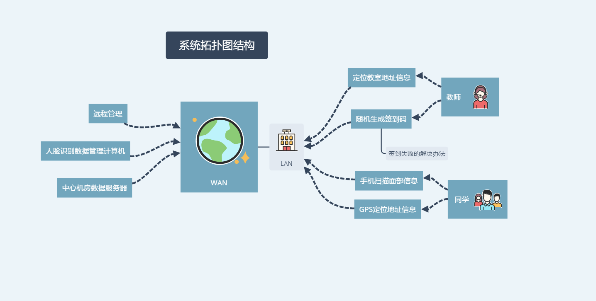
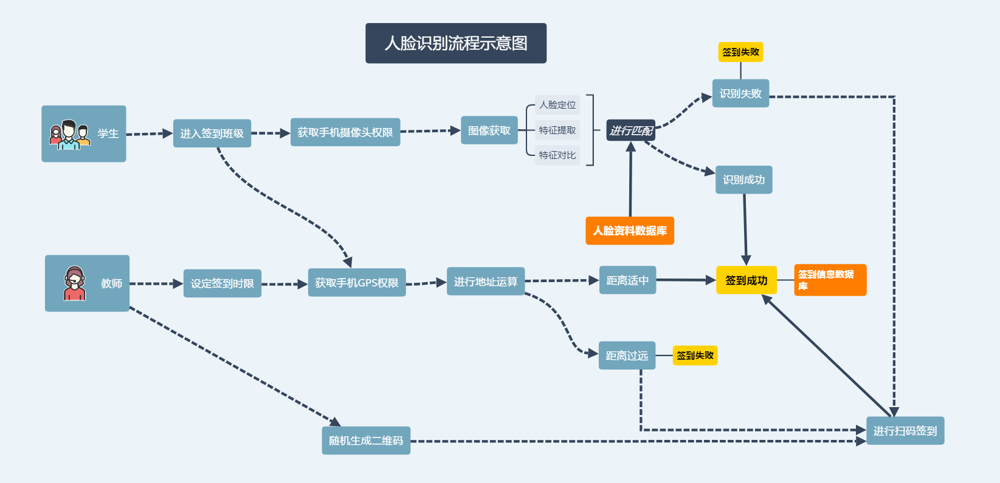
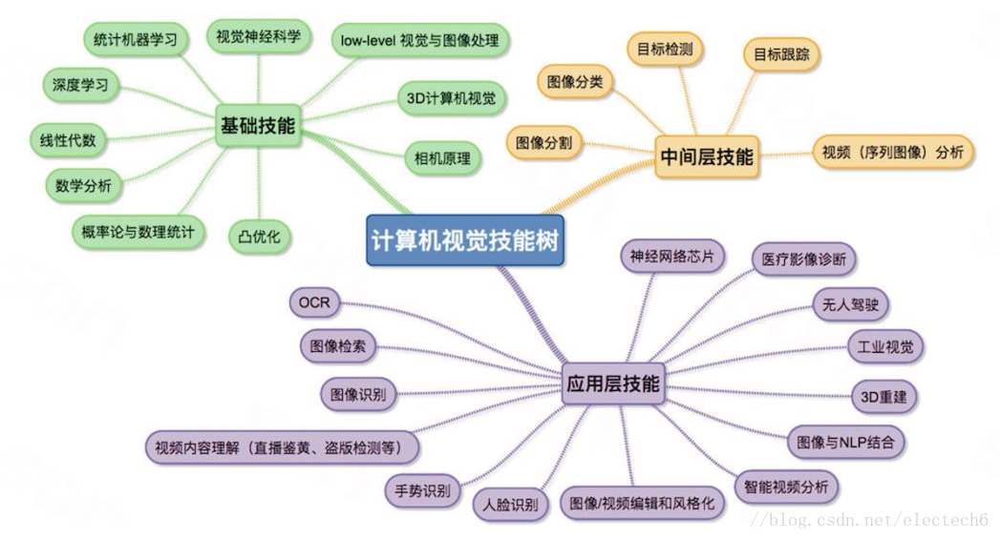

# -萌新撸人脸
人脸检测，活体检测，上课签到

**项目刚开始，代码会慢慢往上加，会加上学习过程，然后最后的项目实现。慢慢入门！**

**先简单介绍一下我们的项目**

**这个就是我们的系统拓扑结构啦！！！**

**然后这个就是我们的流程意图**

**这是我们的系统结构图**

**学习过程:**
python-深度学习入门基于python的理念与实现-吴恩达的深度学习-Opencv

个人感觉这只能算勉强入门 想做出真正的项目还要参加类似kaggle或者天池中的比赛才可以
当然还有我们的技能树了！！！：

**重剑无锋，大巧不公。**
